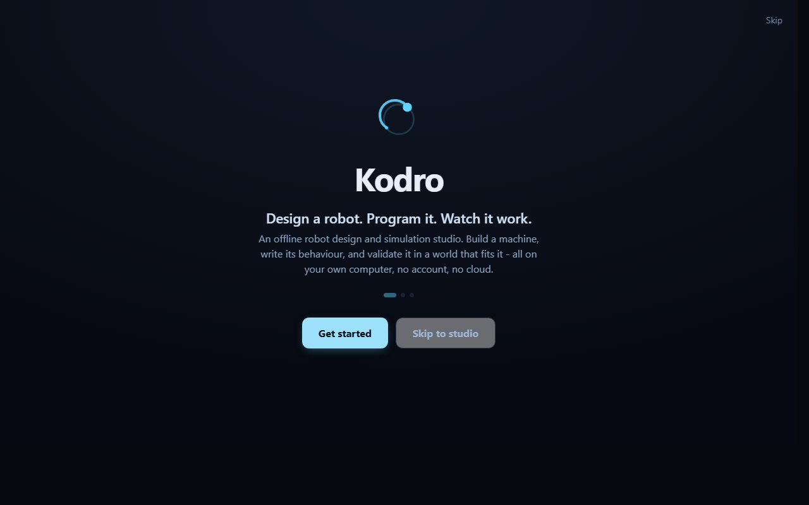
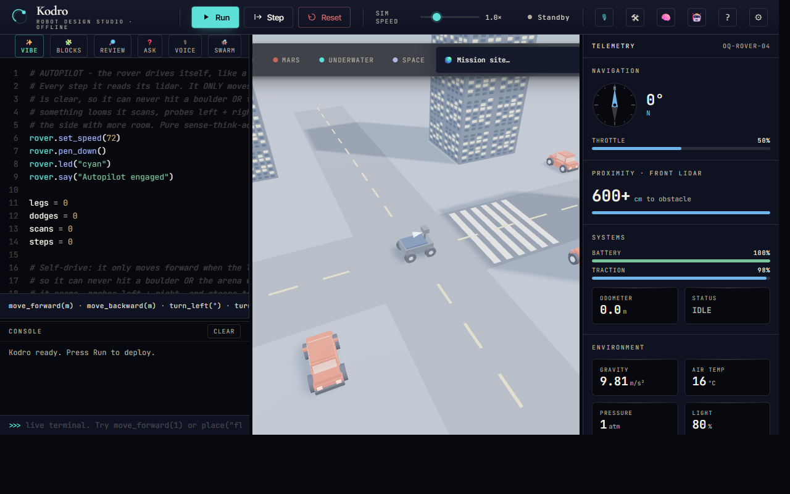

# Kodro

[](https://github.com/vaibhav4046/robolearn/actions/workflows/ci.yml)
[](LICENSE)
[](https://www.python.org/downloads/)

**An offline robot design and simulation studio.** Design a robot. Program it.
Watch it work. Kodro runs entirely on your own computer with no account and no
cloud: you build a custom machine, write its behaviour in code, blocks or plain
language, and validate it in a 3D world chosen to suit it. The system reflects
on each run and refines what it suggests next.

## Try it in one command

```
python scripts/demo.py
```

Serves the studio on http://localhost:8080 and opens your browser. No build, no
account, no network. On Windows you can double-click `run-demo.cmd`. See
[`DEMO.md`](DEMO.md).

Kodro is for a capable non expert adult who wants to design and test robot
behaviour without a lab, a kit, or a cloud subscription. It is **not** a
photoreal game engine, it is **not** a cloud robotics suite, and it is **not**
a childrens coding toy. It is a self contained desktop studio for the loop
below.

> This repository accompanies an MSc research project (COMP702, University of
> Liverpool). The specification and design proposal is in
> [`docs/ca1/`](docs/ca1/) and the dissertation in
> [`docs/dissertation/`](docs/dissertation/).

## The loop

```
 design  ->  program  ->  validate  ->  refine
   |           |             |            |
 Robot Lab   code /        a 3D world   localStorage
 boards,     blocks /      picked for   reflections
 sensors,    voice, with   the robot:   and saved
 actuators   a grounded    city, room,  skills feed
 and type    local AI      or terrain   the next run
```

1. **Design.** In the Robot Lab you assemble a robot from a board, sensors,
   actuators and a chassis type (rover, car, home or arm). Kodro derives its
   mass, top speed and runtime from the parts you choose.
2. **Program.** Write procedural Python against a small, readable API, stack
   Scratch style blocks that compile to that same Python, or describe the
   behaviour and let a local AI model draft it. A code reviewer and an ask
   panel sit alongside the editor.
3. **Validate.** Kodro recommends the world that fits the robot and drops it in:
   a self driving car gets the City with one way traffic, pedestrians and a
   crossing; a home or arm robot gets the Room with furniture; a rover gets
   planetary terrain. You orbit the scene 360 degrees and watch it drive with
   weight transfer, banking and suspension rather than sliding.
4. **Refine.** Every run is recorded. The memory layer reflects on outcomes and
   keeps the skills you save, so the studio gets more useful from your own
   verified work. This is honest, system level self refinement in localStorage,
   not retraining of any model weights.

## Screenshots

The first run landing, with the brand mark and the positioning:



The studio: code editor on the left, the City world with looping traffic, a
crossing and the robot in the middle, and live telemetry on the right.



These are rendered from the real app (the WebGL viewport included) via the
offline capture script `scripts/build_screenshot_harness.cjs` plus headless
Chrome; see [`HUMAN_TODO.md`](HUMAN_TODO.md) for how to regenerate them.

## Features

- **Robot Lab.** Build a custom robot from real parts and let Kodro derive its
  physical envelope and recommend a world for it.
- **Three ways to program, all offline.** A Python subset interpreter, a blocks
  editor that emits the same Python, and an optional local AI assistant
  (Ollama on `localhost`, a small 3 to 4B open model) with a deterministic rule
  based fallback when Ollama is absent.
- **Realistic worlds.** A City with looping one way traffic and pedestrians
  that brake for your robot, a furnished Room, and planetary terrains. Built in
  code with Three.js (core only), an environment map, shadows and tone mapping.
- **Natural motion.** Per type motion feel so a car throws its weight around, a
  heavy rover stays measured, a humanoid stays upright, and a fixed arm does
  not pitch as it works.
- **Self refinement.** A localStorage memory of reflections and saved skills
  that informs later sessions. No cloud, no accounts, no model retraining.
- **First run onboarding.** A skippable landing, robot picker and world
  recommendation, remembered so returning users go straight to the studio.
- **Strictly offline.** Zero paid services, zero API calls, zero accounts.

## Quick start (from source)

```bash
git clone https://github.com/vaibhav4046/robolearn.git
cd robolearn
pip install -e ".[dev]"
python -m robolearn.web   # modern web UI in a native window (pywebview)
```

The web UI is pre compiled to a single `bundle.js`, so the desktop app loads
plain JavaScript with no build server and no network. To rebuild after editing
any `.jsx` source:

```bash
node scripts/build_web.cjs
```

To build the standalone Windows executable:

```bash
python scripts/build_exe.py    # -> dist/RoboLearn.exe (windowed WebView2 app)
```

## A first program

```python
# A rover that drives a square and leaves a trail.
rover.set_speed(60)
rover.pen_down()
for side in range(4):
    rover.forward(200)
    rover.turn_right(90)
```

Two call styles are both valid: bare `move_forward(2)` moves 2 metres, while
`rover.forward(200)` moves 200 cm in engine units. Press **Run** and watch it
drive; press **Step** to advance one event at a time.

## Architecture

| Layer | What | Where |
| --- | --- | --- |
| Web UI | Vendored React and Three.js r137, pre compiled to `bundle.js` | `src/robolearn/assets/web/` |
| Interpreter | Python subset, compiles to a generator of motion and sensor events | `src/robolearn/assets/web/interpreter.js` |
| Worlds and motion | City, Room and terrains, type aware robots, natural motion tick | `Viewport3D.jsx`, `terrains.jsx`, `agents.jsx` |
| Robot Lab and memory | Parts catalogue, world recommendation, self refinement | `RobotLab.jsx`, `memory.jsx` |
| Python engine | Metres world, pymunk and pygame-ce physics, public rover API | `src/robolearn/engine/`, `rover_api.py` |

A fuller diagram and chapter by chapter design are in
[`docs/dissertation/`](docs/dissertation/).

## Quality

Measured, not asserted. Reproduce both locally:

```bash
node scripts/qa_interpreter.mjs   # interpreter and kinematics functional QA
python -m pytest                  # Python engine test suite
```

- **Interpreter QA: 21 of 21 passing.** Every shipped example program
  terminates, moves, stays inside the arena box, never hits a wall and never
  throws. Command semantics (metres versus centimetres, turn, speed clamp,
  guarded huge exponents, for and while, sensors) are all asserted.
- **Python engine: 851 passed, 1 skipped, around 86 percent coverage**, gated
  at `--cov-fail-under=85`. The single skip is an environment bound Tk test.

The honest marker assessment of the project to date is a strong A. An A star
band depends on the empirical teacher and user study, which only a real run can
produce; see [`HUMAN_TODO.md`](HUMAN_TODO.md).

## Documentation

Full docs live in [`docs/`](docs/) and are served via MkDocs Material:

```bash
mkdocs serve -f docs/mkdocs.yml
```

## Acknowledgements

Submitted in partial fulfilment of COMP702 at the University of Liverpool.
Parts of the implementation and documentation were produced with AI assistance,
disclosed in the dissertation.

## Licence

Released under the [MIT Licence](LICENSE).
