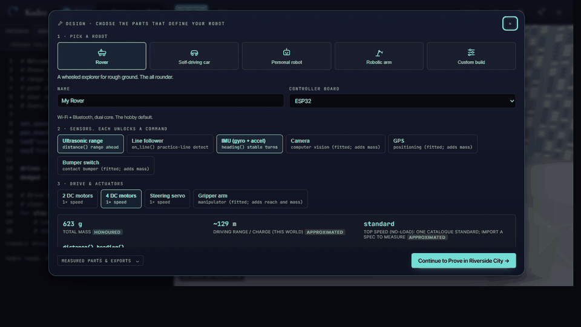

# Kodro: Offline Robot Design, Deterministic Proof, and Build Planning

[](https://github.com/vaibhav4046/robolearn/actions/workflows/ci.yml)
[](https://github.com/vaibhav4046/robolearn/actions/workflows/deploy-pages.yml)
[](LICENSE)
[](https://www.python.org/downloads/)

**Design a robot. Test its program under disclosed simulation limits. Carry the evidence into a provisional build plan.**

**Try it now, zero install: [vaibhav4046.github.io/robolearn](https://vaibhav4046.github.io/robolearn/)**. The browser build runs entirely client side and works offline after the first load. The full desktop app adds the local Python engine, lesson grading, and multi pupil progress.

Kodro is a self-contained desktop and static web studio. You assemble or
import a robot specification, write its behaviour in code, blocks or plain
language, and test it in a disclosed kinematic simulation. Deterministic
code owns capability checks, seeded metrics and PASS or FAIL verdicts. The
optional local model can draft and explain, but it cannot change a verdict.
The default path requires no account, paid service or cloud connection.

Kodro is for a capable non expert adult who wants to design and test robot
behaviour without a lab, a kit, or a cloud subscription.

> This repository accompanies an MSc research project (COMP702, University
> of Liverpool). The specification and design proposal is in
> [`docs/ca1/`](docs/ca1/) and the dissertation in
> [`docs/dissertation/`](docs/dissertation/).

## What Kodro is NOT

Kodro is a research and teaching studio, not an industrial simulator. To
set honest expectations up front:

- **Not a production robotics simulator.** It is a desktop research and
  learning tool, not a deploy-time validation pipeline.
- **Not a replacement for Isaac Sim, Gazebo, Webots or MuJoCo.** Those are
  heavyweight physics simulators with rigid body dynamics, contact
  solvers and ecosystem support. Kodro does kinematic motion with a
  hand written tick. See [`docs/known-limitations.md`](docs/known-limitations.md).
- **Not ROS2.** There is no ROS2 bridge, topic publisher or message
  types. A bridge is on the roadmap, not in the code.
- **Not cloud-connected by default.** No account is ever required and
  nothing leaves your machine on the default path: the local AI
  assistant talks only to an Ollama model on `localhost`, and falls
  back to a deterministic rule engine when Ollama is absent. You may
  optionally connect a free-tier key (Groq, or OpenRouter's free
  models) for a stronger model; that key stays in your browser, is sent
  only to the provider you pick, and is never required.
- **Not a childrens coding toy.** It assumes a capable non expert adult.

## The three-stage loop

```text
Design  ->  Prove  ->  Build
 parts      program    provisional brief
 spec       contracts  assumptions and limits
 commands   manifests  competent-person checks
```

1. **Design.** Assemble a catalogue robot or import measured values.
   Kodro derives its mass, motion envelope, battery estimate, fitted
   command set and per-value fidelity disclosure.
2. **Prove.** Write or generate a program, choose a world and replay a
   declarative contract over controlled seeds. Kodro emits metrics, a
   deterministic verdict and a downloadable evidence manifest.
3. **Build.** Export a provisional brief that carries requirements,
   assumptions and simulation limits forward. Original datasheets,
   electrical protection and mechanical fit still require competent
   review before purchase or power-up.

Lessons, teacher progress, blocks, replay, history and simulation limits
remain available through **More Tools** without competing with the primary
journey. Expert mode exposes the full editor, console and evidence rail.

## Five-minute evidence demo

1. Open [the live build](https://vaibhav4046.github.io/robolearn/) and choose **Design**.
2. Change a part and inspect the resulting capability and fidelity changes.
3. Choose **Prove**, run the program, then run the five-seed proof.
4. Inspect the contract metrics and download the evidence manifest.
5. Open **Simulation limits** from **More Tools** and state the kinematic boundary.
6. Choose **Build** and inspect the provisional build brief.

The demo does not establish real-world equivalence, electrical safety,
classroom efficacy or a guaranteed frame rate.

## Features

What actually ships in this repository, verified against the test suite:

- **Robot Lab.** Build a custom robot from real parts and let Kodro
  derive its physical envelope and recommend a world for it.
- **Three ways to program, all offline.** A Python subset interpreter,
  a blocks editor that emits the same Python, and an optional local AI
  assistant (Ollama on `localhost`, a small 3 to 4B open model) with a
  deterministic rule based fallback when Ollama is absent.
- **Realistic worlds.** A City with looping one way traffic and
  pedestrians that brake for your robot, a furnished Room, and
  planetary terrains. Built in code with Three.js (core only), an
  environment map, shadows and tone mapping.
- **Natural motion.** Per type motion feel so a car throws its weight
  around, a heavy rover stays measured, a humanoid stays upright, and
  a fixed arm does not pitch as it works.
- **Local experience memory.** Reflections and saved skills can inform
  later suggestions. Storage and retrieval are implemented; a causal
  reduction in design iterations has not been demonstrated.
- **Telemetry.** Live heading, battery, LIDAR distance and traction, plus a
  compass dial and arc gauges in the sensors rail.
- **Procedural sound effects.** Every cue (drive, turn, scan, LED,
  speech, pass, fail, crash) is synthesised at runtime with the Web
  Audio API or the standard library. No audio files, no network.
- **Curriculum lessons.** Eighteen bundled lessons mapped to the UK
  DfE / BCS computing programme of study, from KS1 through KS4
  stretch, each with success criteria and offline hints.
- **Offline by default.** No account, paid service or mandatory network
  call is required for Design, Prove, lessons or deterministic checking.
  Local Ollama is optional, and cloud models are an explicit
  bring-your-own-key connected mode.

For what is partial, experimental or only on the roadmap, see
[`docs/implementation-status.md`](docs/implementation-status.md).

## Product loop

This loop is captured from the real application and shows the primary
Design, Prove and Build stages.



## Screenshots

The first run landing, with the brand mark and the positioning:


The studio: code editor on the left, the City world with looping
traffic, a crossing and the robot in the middle, and live telemetry on
the right.


These are rendered from the real app (the WebGL viewport included) via
the offline capture script `scripts/build_screenshot_harness.cjs` plus
headless Chrome; see [`HUMAN_TODO.md`](HUMAN_TODO.md) for how to
regenerate them.

## Download and install

### Option 1: Windows executable (no Python needed)

Download the Kodro app (`RoboLearn-windows.exe`) from the
[latest release](https://github.com/vaibhav4046/robolearn/releases/latest)
and run it. It is a self contained windowed app (WebView2). If WebView2
is unavailable, use the `robolearn-windows-tk.exe` fallback asset from
the same release. Everything works immediately except the optional AI
assistant, which needs a local model (next section).

### Option 2: From source (Windows, macOS, Linux)

Requires Python 3.12+ and Node.js (Node only if you want to rebuild the UI).

```bash
git clone https://github.com/vaibhav4046/robolearn.git
cd robolearn
pip install -e ".[dev]"
python -m robolearn.web   # modern web UI in a native window (pywebview)
```

### Optional: the local AI assistant (Ollama)

The Vibe, Review and Ask panels use a local model through
[Ollama](https://ollama.com/download). Without it the app still works
fully; those panels fall back to a deterministic rule engine. To enable
the assistant:

1. Install Ollama for your OS from <https://ollama.com/download> and
   start it (it serves on `localhost:11434`).
2. Pull a small code model (3 to 4B runs on a normal laptop):

   ```bash
   ollama pull qwen2.5-coder:3b     # good default
   # or: ollama pull gemma3:4b
   ```

3. Start Kodro. It auto detects whatever model Ollama has and shows it
   in the Vibe panel; you can switch models there. Nothing ever leaves
   your machine: the only network peer the app will talk to is
   `localhost:11434`.

**Using the hosted web build with Ollama.** The desktop app needs none of
this. The browser build at
[vaibhav4046.github.io/robolearn](https://vaibhav4046.github.io/robolearn/)
is served from a different origin than `localhost`, so Ollama must be told
to accept requests from it. Start Ollama with that origin allowed:

- Windows: run `setx OLLAMA_ORIGINS "https://vaibhav4046.github.io"`, then
  restart Ollama.
- macOS or Linux: run `OLLAMA_ORIGINS=https://vaibhav4046.github.io ollama serve`.

Without this the browser build cannot reach your local model and falls back
to the deterministic rule engine.

The web UI is pre compiled to a single `bundle.js`, so the desktop app
loads plain JavaScript with no build server and no network. To rebuild
after editing any `.jsx` source:

```bash
node scripts/build_web.cjs
```

To build the standalone Windows executable:

```bash
python scripts/build_exe.py    # -> dist/RoboLearn.exe (windowed WebView2 app)
```

A one command demo is also available:

```bash
python scripts/demo.py        # serves on http://localhost:8080
```

## A first program

```python
# A rover that drives a square and leaves a trail.
rover.set_speed(60)
rover.pen_down()
for side in range(4):
    rover.forward(200)
    rover.turn_right(90)
```

Two call styles are both valid: bare `move_forward(2)` moves 2 metres,
while `rover.forward(200)` moves 200 cm in engine units. Press **Run**
and watch it drive; press **Step** to advance one event at a time.

## Architecture

| Layer | What | Where |
| --- | --- | --- |
| Web UI | Vendored React and Three.js r137, pre compiled to `bundle.js` | `src/robolearn/assets/web/` |
| Interpreter | Python subset, compiles to a generator of motion and sensor events | `src/robolearn/assets/web/interpreter.js` |
| Worlds and motion | City, Room and terrains, type aware robots, natural motion tick | `Viewport3D.jsx`, `terrains.jsx`, `agents.jsx` |
| Robot Lab and memory | Parts catalogue, world recommendation, self refinement | `RobotLab.jsx`, `memory.jsx` |
| Python engine | Metres world, pymunk and pygame-ce physics, public rover API | `src/robolearn/engine/`, `rover_api.py` |

A fuller diagram and chapter by chapter design are in
[`docs/dissertation/`](docs/dissertation/).

## Quality

Measured, not asserted. Reproduce both locally:

```bash
node scripts/qa_interpreter.mjs   # interpreter and kinematics functional QA
python -m pytest                  # Python engine test suite
```

- **Interpreter QA: all checks pass** (180 at the candidate release state; reproduce
  with `node scripts/qa_interpreter.mjs`). Every shipped example program
  terminates, moves, stays inside the arena box, never hits a wall and
  never throws. Command semantics (metres versus centimetres, turn,
  speed clamp, guarded huge exponents, for and while, sensors), Python
  parity edge cases (chained comparison, division by zero, banker's
  rounding, range validation) and malformed input handling are all
  asserted.
- **UI regression net.** `node scripts/qa_ui.mjs` drives the real
  bundle in headless Chrome: six rendered flows, 33 behavior assertions,
  six responsive layouts and 12 modal surfaces. `qa_worlds.mjs` adds 61
  world, robot, quality, site and weather identity checks.
- **Python matrix.** 1,087 tests pass with zero skips and 88.21 percent
  branch-aware coverage on the candidate Windows verification host,
  above the 85 percent repository gate.
- **Deterministic Prove.** Four contracts pass 20 of 20 seeded runs,
  reproduce byte-identically and reject the deliberately broken controller.
- **Python engine and CLI: 950+ tests passing**, coverage gated at
  `--cov-fail-under=85` on every push.

The honest marker assessment of the project to date is a strong A. An A
star band depends on the empirical teacher and user study, which only a
real run can produce; see [`HUMAN_TODO.md`](HUMAN_TODO.md).

## KodroBench: measuring grounded code

A grounded local model must not invent commands outside the robot's fitted
set. KodroBench measures exactly that. It asks a model to write rover
programs for seeded tasks, then scores whether the program stays inside the
build's real command set (invention_rate, lower is better) and whether it
completes the task (success@N, higher is better). Full results and the
methodology are in
[`results/kodrobench-leaderboard.md`](results/kodrobench-leaderboard.md).

How to read the numbers: success@N is the mean seeded-task success over N
seeds (v0.1 runs 5 tasks over 10 seeds). The dev/heldout split is the same
task set divided by whether a task was visible while iterating, so heldout
success is the honest generalisation figure; invention_rate is the fraction
of runs that call a command the fitted robot does not have.

| Model | success@N | invention_rate |
| --- | --- | --- |
| gemma3:4b | 0.24 | 0.00 |
| deterministic | 0.22 | 0.00 |
| gemma3:1b | 0.02 | 0.00 |
| llama3.2:3b | 0.00 | 0.00 |
| kodro-fast:latest | 0.00 | 0.60 |
| kodro-coder:latest | 0.00 | 1.00 |

The honest story of these numbers is that the project's own fine-tunes are
the worst behaved. `kodro-fast` and `kodro-coder` invent `rover.*` commands
at 0.60 and 1.00 while never completing a task (0.00 success@N), whereas the
general models hold invention_rate at 0.00. The deterministic floor, a rule
engine with no model at all, scores 0.22 success@N: it beats every fine-tune
and comes within 0.02 of the best general model (gemma3:4b at 0.24). A
grounded rule engine is a strong baseline, and naive fine-tuning of tiny
models made grounding worse, not better, which is why the deterministic
fallback ships as the honest default.

Reproduce the benchmark yourself:

```bash
kodrobench --help                        # console script
python -m robolearn.kodrobench --help    # module entry point
```

## Documentation

Full docs live in [`docs/`](docs/) and are served via MkDocs Material:

```bash
mkdocs serve -f docs/mkdocs.yml
```

For the boundaries of what Kodro does and does not do, read:

- [`docs/known-limitations.md`](docs/known-limitations.md)
- [`docs/roadmap.md`](docs/roadmap.md)
- [`docs/implementation-status.md`](docs/implementation-status.md)

## Acknowledgements

Submitted in partial fulfilment of COMP702 at the University of
Liverpool. Parts of the implementation and documentation were produced
with AI assistance, disclosed in the dissertation.

## Licence

Released under the [MIT Licence](LICENSE).
