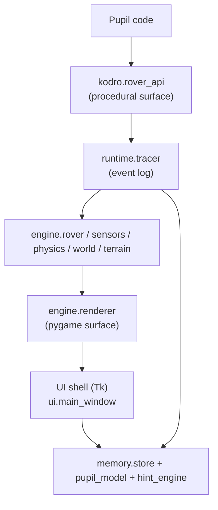

# Architecture

## Why procedural

The pupil-facing surface (`rover_api`) is deliberately procedural because the
audience is a non-specialist secondary-school teacher reading the source. The
engine internals are object-oriented where state genuinely benefits from
encapsulation, but the top-level wiring (`app.py`) is kept flat.

## Subsystems

| Module | Responsibility | Build-plan task |
| --- | --- | --- |
| `rover_api` | The pupil-facing functions | Task 2 |
| `engine.physics` | Pymunk-backed physics with per-terrain gravity / friction | Task 3 |
| `engine.world` | Obstacles, samples, base station | Task 3 |
| `engine.rover` | Rover entity + actuators | Task 3 |
| `engine.sensors` | LIDAR, ultrasonic, IMU, colour | Task 4 |
| `engine.terrain` | Terrain registry + per-terrain parameters | Task 3 |
| `engine.renderer` | Pygame draw routines | Task 5 |
| `runtime.tracer` | Per-call event log; powers grading and replay | Task 6 |
| `runtime.sandbox` | AST-based restriction of pupil-code imports / builtins | Task 7 |
| `runtime.executor` | Subprocess executor with hard timeout | Task 7 |
| `lessons.schema` | Pydantic schema + YAML loader for lessons | Task 8 |
| `lessons.grader` | Auto-grade a submission against success criteria | Task 9 |
| `memory.store` | SQLite schema + CRUD | Task 10 |
| `memory.pupil_model` | EMA strength/weakness model | Task 10 |
| `memory.hint_engine` | Offline rule-based hint matcher | Task 10 |
| `ui.*` | Tk shell, panels, dashboards, replay dialog | Tasks 11–17 |
